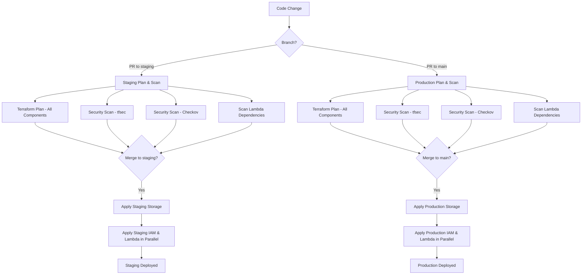

# Part B: CI/CD Implementation

## Pipeline Workflow

Implement a pipeline following a branch based deployment structure with staging and main for respective staging and prod environments. Access tokens stored in secrets for the different environments and utilised in the pipelines. Assumption made of github so using github actions, but there is no real reason this couldn't be done in any other provider (bitbucket, jenkins, circleci, teamcity etc.).

### Staging Branch Workflow

- **PR to staging**:
  - Terraform plan (output and stored for apply in next step)
  - security scans (tfsec, Checkov + scan lambda dependancies)
- **Merge to staging**:
  - Apply staging environment in dependency order:
  1. Storage (must run first)
  2. IAM and Lambda components (can run in parallel)

### Production Branch Workflow

Same as staging but main branch instead.

## Pipeline Diagram

